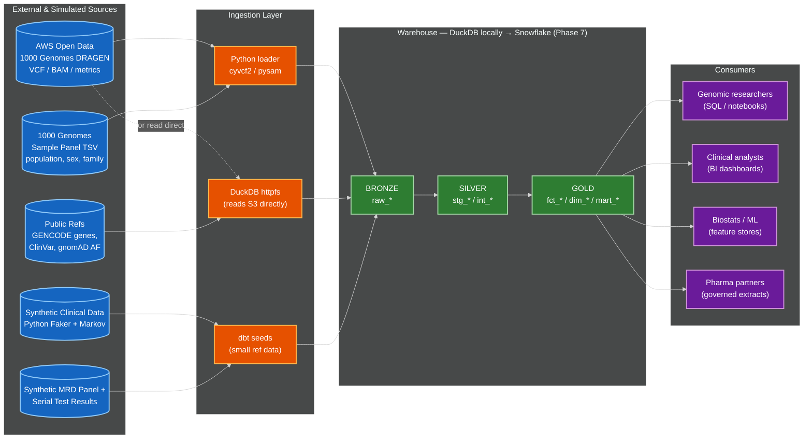

# 1000 Genomes Data Warehouse — Reference Implementation

A medallion-architecture data warehouse that ingests 1000 Genomes Project germline VCFs,
synthesizes Signatera-style MRD test data on top, and exposes a star schema plus governed
OBT marts for downstream analytical use cases. Built with dbt on DuckDB locally, with a
dispatch-macro architecture that ports cleanly to Snowflake (see `runbook/phase-7-snowflake.md`).

## Architecture



## What's in this repo

- `loader/` — Python ingestion scripts (VCF → Parquet, panel TSV, GENCODE/ClinVar)
- `synth/` — Synthetic clinical and MRD trajectory generators (deterministic from `--seed`)
- `genomics_dwh/` — dbt project (9 staging views, 3 intermediate tables, 6 dimensions, 4 facts, 2 OBT marts, 1 snapshot, 91 tests)
- `bronze/` — Lakehouse Bronze layer (Parquet on disk; gitignored)
- `data/raw/` — Raw VCFs, reference data (gitignored)
- `analyses/` — 10 persona-aligned analytical queries demonstrating real warehouse use
- `docs/` — Architecture diagrams, dbt docs site, Snowflake benchmark captures
- `runbook/` — Per-phase command logs with captured outputs (full reproducibility)

## Running it from scratch

```bash
# 1. Environment (one-time)
python3.11 -m venv .venv && source .venv/bin/activate
pip install -r requirements.txt
brew install duckdb bcftools awscli

# Set the warehouse root location so dbt sources can find Bronze
export DWH_REPO_ROOT=$(pwd)
# Or use direnv: echo "export DWH_REPO_ROOT=$(pwd)" > .envrc && direnv allow

# 2. Acquire data (~30-50 min; ~200GB disk for 50 samples)
python loader/fetch_1kg_data.py --samples 50 --seed 42
python loader/extract_region.py --region chr22
./loader/fetch_reference_data.sh

# 3. Bronze layer (~5 min)
duckdb warehouse.duckdb < loader/init_warehouse.sql
python loader/vcf_to_parquet.py
python loader/panel_to_parquet.py
python loader/reference_to_parquet.py

# 4. Synthetic data (~30 sec)
python synth/generate_patients.py --seed 42
python synth/generate_panels.py --seed 42
python synth/generate_trajectories.py --seed 42
python synth/synth_to_parquet.py

# 5. dbt build
cd genomics_dwh
dbt deps
dbt snapshot
dbt build
# Expected: PASS=109+ WARN=0 ERROR=0

# 6. Explore
dbt docs generate && dbt docs serve
# TODO: Or run any of the persona analytical queries
dbt show --select q03_mrd_positivity_by_landmark --limit 50
