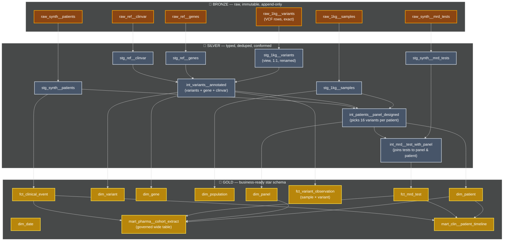
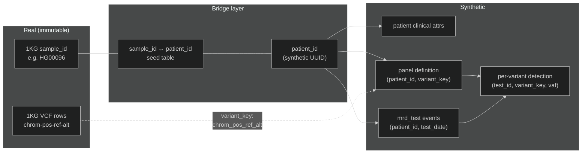
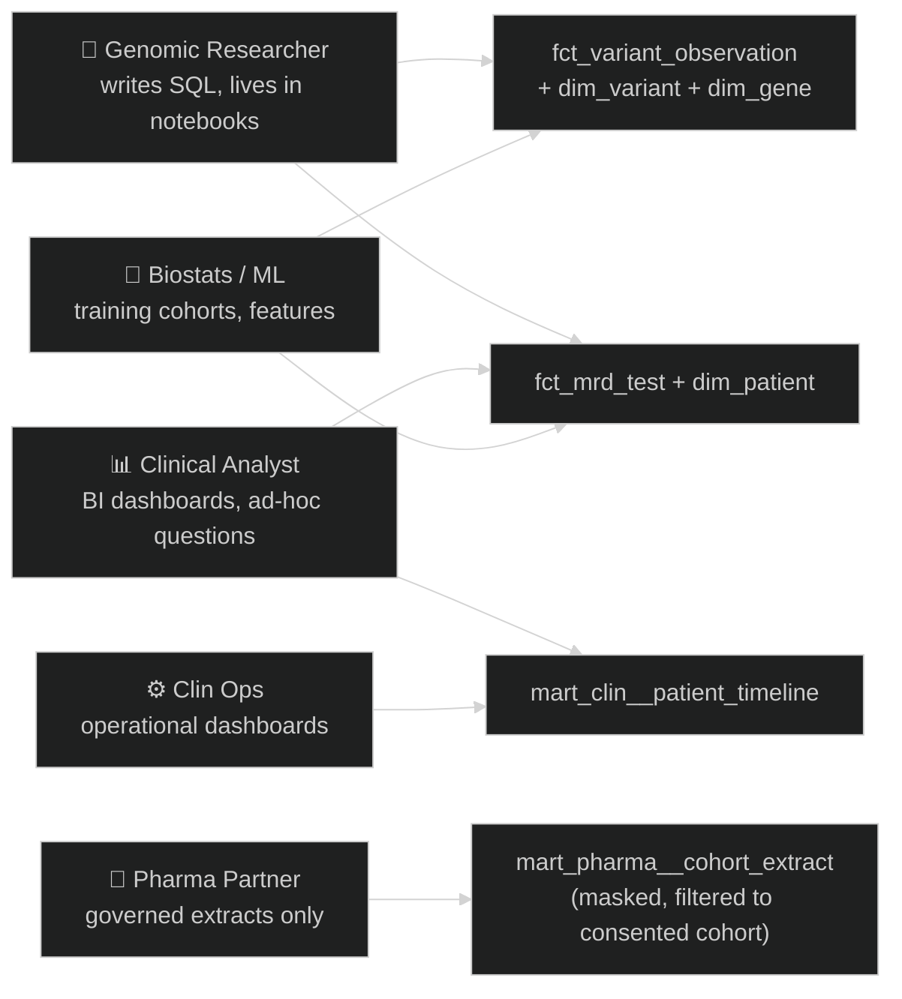

Welcome to our dbt project!

## Medallion Layer Mapping


**Why this layering matters** (lifted from current dbt guidance): Bronze — raw data, loaded as-is from source systems · Silver — cleaned, deduplicated, and properly typed data · Gold — aggregated, business-ready tables for reporting and analytics. Bronze Layer = Staging Models (stg_) - One-to-one source relationships · Silver Layer = Intermediate Models (int_) - Business logic transformations · Gold Layer = Marts (dim_, fct_) - Business-ready data products.

The Bronze/Silver/Gold language and the dbt staging/intermediate/marts language describe the same pattern; this project uses both consistently — **Bronze = `raw_*` tables, Silver = `stg_*` (views) + `int_*` (tables), Gold = `dim_* / fct_* / mart_*`**.

---

## The Linking Strategy

The Linking Strategy



The **`variant_key = chrom || '_' || pos || '_' || ref || '_' || alt`** is the natural key shared across genomic and clinical worlds. This is the join you'll write a hundred times — make it a macro on day one.

---

## dbt Materialization Strategy (DuckDB & Snowflake)

| Layer | Materialization | Why |
|---|---|---|
| `raw_*` | Bronze table, loaded by Python, *not* a dbt model | dbt doesn't own ingestion — it's downstream |
| `stg_*` | **view** | Cheap, always fresh, no storage; it's just a typed alias of bronze |
| `int_*` | **table** (or **ephemeral** for tiny utility transforms) | Materialize once per run so downstream marts join from real tables |
| `dim_*` | **table** (full refresh nightly is fine for dims < 10M rows) | Small, queried often, full rebuild simpler than incremental edge cases |
| `fct_variant_observation` | **incremental** with `unique_key=['sample_id_1kg','variant_key']`, `on_schema_change='append_new_columns'` | This is the billion-row table; full rebuilds are expensive |
| `fct_mrd_test` | **incremental** with `unique_key='test_sk'` | Time-series; only new test dates each run |
| `mart_*` | **table** (or materialized view in Snowflake) for hot ones | Optimized for end-user query speed |

This mapping follows the canonical dbt guidance: staging: +materialized: view, intermediate: +materialized: table, marts: +materialized: table.

**The same materializations work in both DuckDB and Snowflake.** The differences show up only in the *physical optimization* layer — clustering keys, search optimization, automatic clustering services — which we'll wrap in Jinja conditionals (``) so the project runs end-to-end in either target.

---

## Anticipated User Queries & Mart Design

### The Personas



### Real Query Patterns You'll See

> **Landmark analysis.** Every clinical question about MRD ends up as a "landmark" — a fixed time post-surgery (Day 90, Day 180, 1 year, 2 years) at which everyone's MRD status is evaluated. The reason: comparing patients fairly. If patient A had a test 2 weeks after surgery and patient B had a test 8 months after, comparing their results directly is meaningless. So you pick a landmark, find each patient's nearest test to that landmark within a window (say ±30 days), and treat that as their "Day 90 status." The `mart_clin__patient_timeline` precomputes these so dashboards don't have to.

> **Censoring in survival analysis.** Some patients haven't had a recurrence yet — they're still being followed. We don't say "they didn't recur" (we don't know — they might tomorrow); we say they're "censored" at their last follow-up date. Censoring matters because dropping censored patients biases your analysis. Survival curves (Kaplan-Meier) handle this natively; biostats teams use them constantly.

| # | Persona | Question | Hits which models | Why this mart helps |
|---|---|---|---|---|
| 1 | Researcher | "Pull all pathogenic variants in BRCA1/BRCA2 across European-ancestry samples" | `fct_variant_observation` ⋈ `dim_variant` ⋈ `dim_gene` ⋈ `dim_population` | Star joins; chrom+pos sorting prunes 99%+ of chunks |
| 2 | Researcher | "What's the allele frequency of variant X by super-population?" | `fct_variant_observation` ⋈ `dim_population` | Aggregation; clustering on chrom+pos still helps if filter is by region |
| 3 | Clinical analyst | "MRD positivity rate at 6, 12, 24 months post-surgery, by tumor type and stage" | `mart_clin__patient_timeline` | Pre-pivoted landmark analysis — single table, no joins for the dashboard |
| 4 | Clinical analyst | "Show me patients who turned MRD+ before clinical recurrence — what was the lead time?" | `fct_mrd_test` ⋈ `fct_clinical_event` ⋈ `dim_patient` | Window function over patient timeline; also pre-computed in `mart_clin__patient_timeline` |
| 5 | Biostats | "Build a feature matrix: per patient, baseline panel size, baseline ctDNA status, treatment arm, time-to-recurrence" | `mart_pharma__cohort_extract` | One row per patient, all features wide |
| 6 | Pharma partner | "For trial NCT12345, give me MRD landmark status at day 90 stratified by treatment arm" | `mart_pharma__cohort_extract` filtered to that trial_id | Row-level access policy + governed mart |
| 7 | Clin ops | "How many tests are pending result delivery > 7 days?" | `fct_mrd_test` (operational view on top) | Recent partitions only — clustering on test_date is doing all the work |
| 8 | Researcher | "Variants in panel for patient HG00096 detected in their last 3 blood draws" | `dim_panel` ⋈ `fct_mrd_detection` ⋈ `dim_variant` | Patient-scoped query — patient_sk filter prunes ~99.97% on a 30k-patient table |
| 9 | Biostats | "Cumulative incidence of recurrence by stage, censored at last visit" | `fct_clinical_event` + survival library | Long format, well-suited to time-to-event modeling |
| 10 | Clinical analyst | "What % of patients have at least 4 serial tests by 12-month landmark?" | `mart_clin__patient_timeline` | Self-service dashboard; no SQL needed beyond the mart |

### The Two Self-Service "OBT" Marts

These exist *alongside* the star schema, deliberately denormalized for non-SQL-fluent users.

**`mart_clin__patient_timeline`** — one row per (patient × landmark month):

```
patient_sk | landmark_month | tumor_type | stage_at_dx | mrd_status | mrd_positive_count_to_date | 
last_test_date | days_since_surgery | recurrence_flag | days_to_recurrence | latest_treatment_regimen
```

This single table answers ~80% of clinical analyst questions without joins.

**`mart_pharma__cohort_extract`** — one row per patient, governed by `WHERE consented_for_research = TRUE`:

```
patient_sk_masked | trial_id | tumor_type | stage_at_dx | treatment_arm | 
panel_size | baseline_mrd_status | mrd_status_d90 | mrd_status_d180 | mrd_status_d365 | 
recurrence_within_2yr | days_to_recurrence | days_to_death_or_censor
```

Pharma partners read this through a **share** with row-level filtering — they never see raw variant data, never see un-consented patients.

> **What "consented for research" means in practice.** When a patient signs up for testing, they sign a consent form that may or may not allow their de-identified data to be shared with research partners (academic groups, pharma sponsors). The warehouse stores a flag per patient capturing that consent. Pharma extracts must filter on `consented_for_research = true`, full stop, and the data engineering job is to make that *technically impossible* to forget — typically via row access policies in Snowflake or a view layer that hard-codes the filter. This is often a regulatory and contractual requirement, not just a nice-to-have.