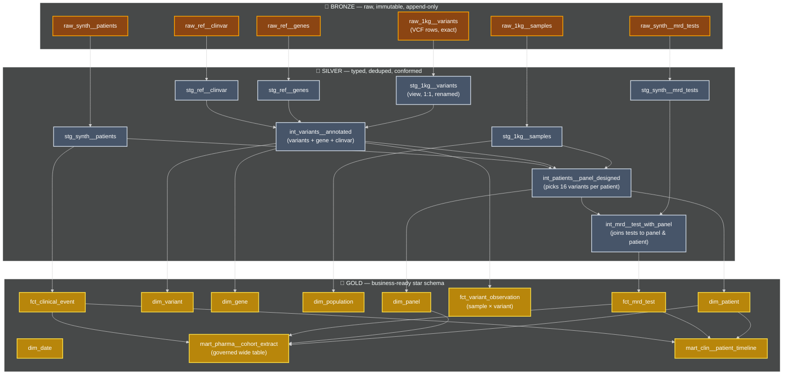
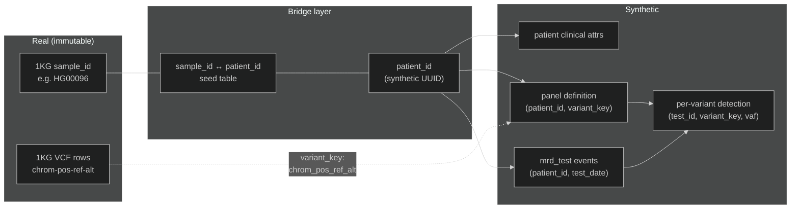
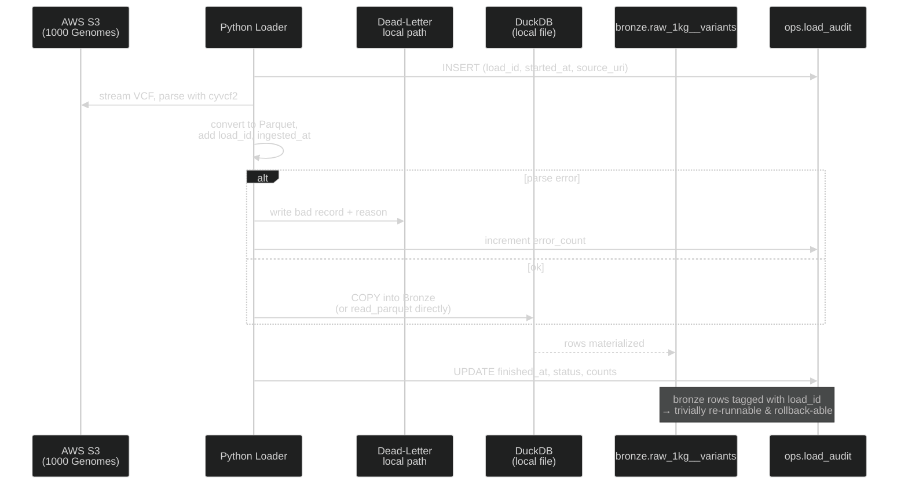

Welcome to our dbt project!

## Medallion Layer Mapping

**Why this layering matters** (lifted from current dbt guidance): Bronze — raw data, loaded as-is from source systems · Silver — cleaned, deduplicated, and properly typed data · Gold — aggregated, business-ready tables for reporting and analytics. Bronze Layer = Staging Models (stg_) - One-to-one source relationships · Silver Layer = Intermediate Models (int_) - Business logic transformations · Gold Layer = Marts (dim_, fct_) - Business-ready data products.

The Bronze/Silver/Gold language and the dbt staging/intermediate/marts language describe the same pattern; this project uses both consistently — **Bronze = `raw_*` tables, Silver = `stg_*` (views) + `int_*` (tables), Gold = `dim_* / fct_* / mart_*`**.

---

## The Linking Strategy

The Linking Strategy

The **`variant_key = chrom || '_' || pos || '_' || ref || '_' || alt`** is the natural key shared across genomic and clinical worlds. This is the join you'll write a hundred times — make it a macro on day one.

---

## Ingestion Sequence (with Failure Handling)

**Resiliency principles baked in:**

- **Append-only Bronze** with `load_id` and `ingested_at` audit columns. Never `DELETE` — re-runs become a `WHERE load_id NOT IN (failed_loads)` filter in Silver.
- **Idempotent Bronze loads** — if you re-run for the same `source_uri`, you get the same `load_id` (deterministic hash) and old rows are dropped before insert via `MERGE`, or you stamp them inactive.
- **Dead-letter prefix** for malformed VCF rows so analysts can audit data quality.
- **Snapshot the DuckDB file** before risky transformations (`cp warehouse.duckdb warehouse.duckdb.bak`) — poor-man's time travel. When you port to Snowflake, real Time Travel takes over (default 1 day, up to 90 on Enterprise).
- **Incremental Bronze→Silver** via dbt's `is_incremental()` pattern, gated on `load_id`.

---

## dbt Materialization Strategy (DuckDB & Snowflake)

| Layer | Materialization | Why |
|---|---|---|
| `raw_*` | Bronze table, loaded by Python, *not* a dbt model | dbt doesn't own ingestion — it's downstream |
| `stg_*` | **view** | Cheap, always fresh, no storage; it's just a typed alias of bronze |
| `int_*` | **table** (or **ephemeral** for tiny utility transforms) | Materialize once per run so downstream marts join from real tables |
| `dim_*` | **table** (full refresh nightly is fine for dims < 10M rows) | Small, queried often, full rebuild simpler than incremental edge cases |
| `fct_variant_observation` | **incremental** with `unique_key=['sample_id_1kg','variant_key']`, `on_schema_change='append_new_columns'` | This is the billion-row table; full rebuilds are expensive |
| `fct_mrd_test` | **incremental** with `unique_key='test_sk'` | Time-series; only new test dates each run |
| `mart_*` | **table** (or materialized view in Snowflake) for hot ones | Optimized for end-user query speed |

This mapping follows the canonical dbt guidance: staging: +materialized: view, intermediate: +materialized: table, marts: +materialized: table.

**The same materializations work in both DuckDB and Snowflake.** The differences show up only in the *physical optimization* layer — clustering keys, search optimization, automatic clustering services — which we'll wrap in Jinja conditionals (``) so the project runs end-to-end in either target.
