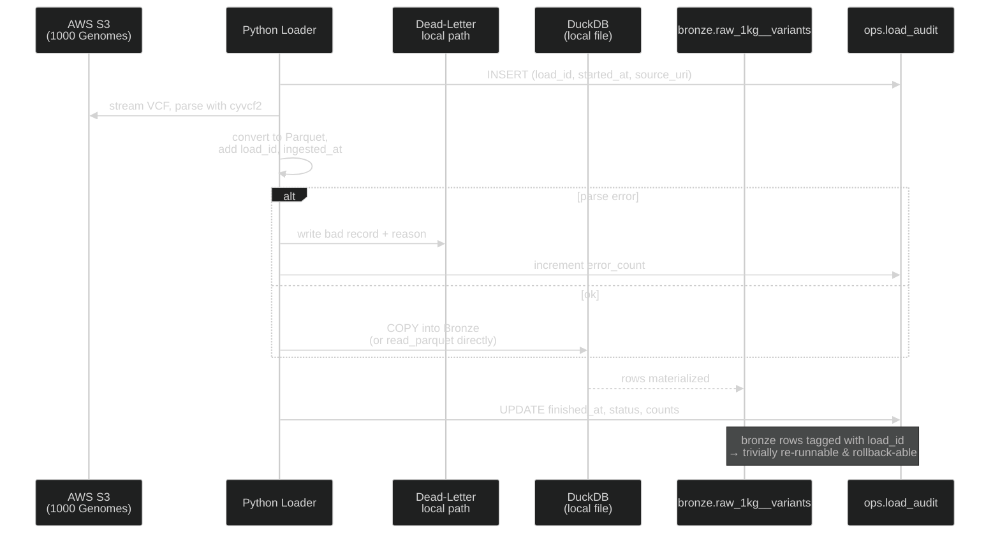

# Raw Data Loading
The loader scripts and initial database schemas.

## Ingestion Sequence (with Failure Handling)

**Resiliency principles baked in:**

- **Append-only Bronze** with `load_id` and `ingested_at` audit columns. Never `DELETE` — re-runs become a `WHERE load_id NOT IN (failed_loads)` filter in Silver.
- **Idempotent Bronze loads** — if you re-run for the same `source_uri`, you get the same `load_id` (deterministic hash) and old rows are dropped before insert via `MERGE`, or you stamp them inactive.
- **Dead-letter prefix** for malformed VCF rows so analysts can audit data quality.
- **Snapshot the DuckDB file** before risky transformations (`cp warehouse.duckdb warehouse.duckdb.bak`) — poor-man's time travel. When you port to Snowflake, real Time Travel takes over (default 1 day, up to 90 on Enterprise).
- **Incremental Bronze→Silver** via dbt's `is_incremental()` pattern, gated on `load_id`.