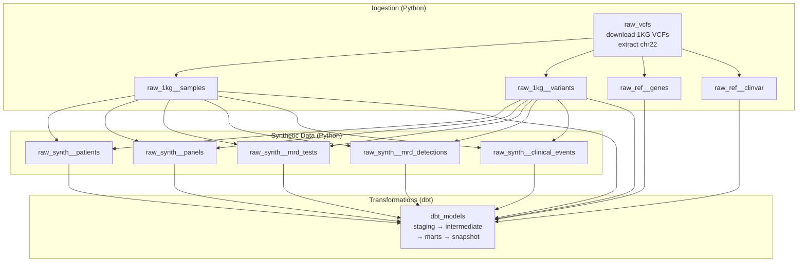
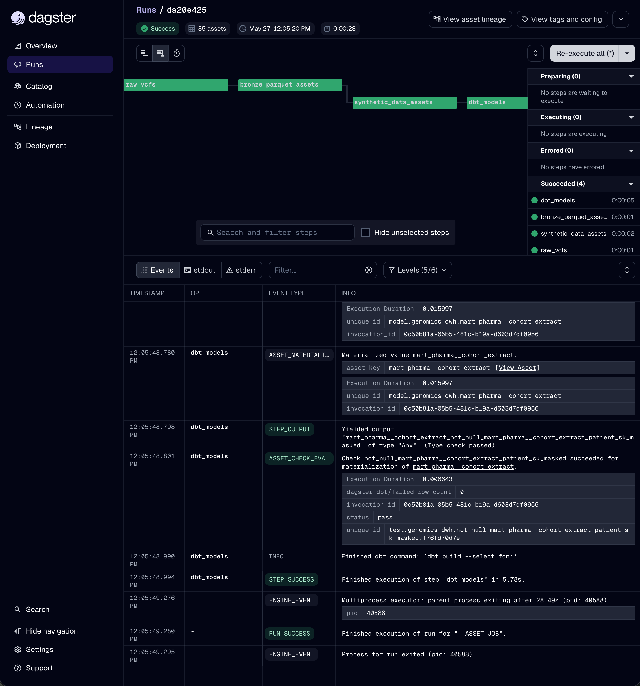

# Orchestration with Dagster

This folder contains the Dagster setup that ties the whole warehouse together into a single, runnable, observable pipeline — from downloading raw genomic data all the way through building the gold-layer marts.

## Picture this

Imagine a factory assembly line. Raw materials come in one end (genomic data files from the internet). They move through stations: unpacking, cleaning, adding synthetic patient records, transforming into analysis-ready tables. At the other end, finished products roll out (the dimensional models and marts that analysts query).

Without orchestration, you're running each station by hand — walk over to station 1, push the button, wait, walk to station 2, push that button, and so on. If you forget a step or run them out of order, you get a broken product and might not notice until much later.

Dagster is the **factory control room**. One dashboard shows every station, what depends on what, what's currently running, what succeeded, what failed, and how long each took. Select the assets and hit "Materialize" and the whole line runs in the correct order automatically. That's what this folder provides.

## What Dagster actually orchestrates here

Our pipeline has three stages, each represented as one or more Dagster **assets** (an asset = a thing that gets produced and stored, like a file or a table):



**Stage 1 — Ingestion (`raw_vcfs` → Bronze Parquet).** Downloads 1000 Genomes VCF files, extracts the chr22 region, and converts everything (variants, sample panel, GENCODE genes, ClinVar) into Bronze-layer Parquet files. These are the four `raw_1kg__*` and `raw_ref__*` assets.

**Stage 2 — Synthetic data (`raw_synth__*`).** Generates the synthetic clinical layer: patients (each linked to a real 1KG sample for their germline background), personalized panels, serial MRD tests, per-variant detections, and clinical events. Five assets, depending on both the 1KG sample list (patients are assigned real sample backgrounds) and the 1KG variant data (panels are built by selecting real heterozygous SNVs from each patient's germline VCF).

**Stage 3 — Transformations (`dbt_models`).** Runs the entire dbt project — staging views, intermediate tables, dimensional models, fact tables, OBT marts, and the SCD-2 snapshot. This is a single Dagster asset that wraps `dbt build`, but internally Dagster sees every individual dbt model and its lineage.

## Why each stage depends on the previous

The arrows in the diagram aren't decoration — they're enforced. Dagster won't start synthetic data generation until the 1KG sample list and variant data exist, because patients are assigned real sample backgrounds and panels are built from real germline variants. It won't start dbt until both the Bronze Parquet and the synthetic Parquet exist, because the staging models read from those files.

> **Picture this:** you can't frost a cake before you bake it, and you can't bake it before you mix the batter. Dagster knows the recipe order and refuses to do steps out of sequence. If you tried to run dbt first on a fresh machine, it would fail because the source files wouldn't exist yet. The dependency wiring prevents that entire class of mistake.

## How the dependencies are wired

This is the non-obvious part, worth understanding if you ever modify the pipeline.

The Python assets declare dependencies directly in `definitions.py` via `deps=[...]` on each `AssetSpec`. Straightforward.

The dbt models are different. Dagster doesn't know dbt depends on the Python loaders just from the Python code — it learns it from the **dbt sources**. In `genomics_dwh/models/staging/_sources.yml`, each source declares which Dagster asset produces it:

```yaml
- name: raw_synth__patients
  meta:
    dagster:
      asset_key: ["raw_synth__patients"]
```

When `dbt parse` regenerates the manifest, Dagster reads these `meta.dagster.asset_key` entries and automatically wires each dbt model to the upstream Python asset it consumes. That's why each Bronze/synth Parquet file is its own named Dagster asset — so the dbt sources have something specific to point at.

> **Picture this:** the dbt sources are like return addresses on envelopes. Each one says "I came from the `raw_synth__patients` asset." Dagster reads the return address and draws the dependency arrow automatically. No manual wiring needed beyond declaring the addresses.

## Running it



```bash
# From the orchestrator/ directory
cd orchestrator

# Launch the Dagster dev UI
dg dev -f definitions.py
# (the older `dagster dev -f definitions.py` also works but prints a deprecation warning)
```

Then open <http://localhost:3000>:

1. Click **Catalog** in the left sidebar (this is where assets live in current Dagster; older versions called this the "Assets" tab)
2. You'll see the full set of assets: ingestion → synth → dbt
3. Select all rows (use the header checkbox to select everything, or filter then select)
4. Click **Materialize** to run the selected assets in dependency order
5. Watch each asset move through Queued → Running → Materialized
6. Click any asset to see its logs, run history, and metadata

To run just part of the graph, select only the assets you want in the Catalog (or use the lineage view), then Materialize. Selecting a downstream asset gives you the option to include its upstream dependencies.

## Files in this folder

- `definitions.py` — the Dagster definitions: all assets, their dependencies, and the dbt resource. This is the single entry point Dagster loads.
- `README.md` — this file.

## Prerequisites

Install the Dagster packages (note `dagster-webserver` is separate from `dagster` itself, and `dg` ships in `dagster-dg-cli`):

```bash
pip install dagster dagster-webserver dagster-dg-cli dagster-dbt dagster-duckdb
```

The dbt project must have a generated manifest. The `DbtProject` helper in `definitions.py` calls `prepare_if_dev()` which auto-generates it when running locally via `dg dev`. For other contexts, run `cd genomics_dwh && dbt parse` first.

## Why this matters (the bigger picture)

The difference between a pile of scripts and a data platform is the difference between a box of car parts and a car. The parts might all be high quality, but until they're assembled into something that runs as a unit — with the engine connected to the transmission connected to the wheels — you don't have a vehicle.

Our Python loaders and dbt models are good parts. Dagster is the assembly. It turns "a collection of things that each do one job" into "a pipeline that produces analysis-ready data from raw inputs in one command, with full visibility into every step." That unified-graph view — raw data on one side, gold marts on the other, every dependency explicit — is the modern data platform mental model, and it's what separates a project from a product.

This orchestration layer is optional for the project (the warehouse builds fine by running the loaders and dbt manually), but it's the piece that demonstrates platform-level thinking: not just "can you transform data" but "can you make the whole system reproducible, observable, and runnable by someone who isn't you."