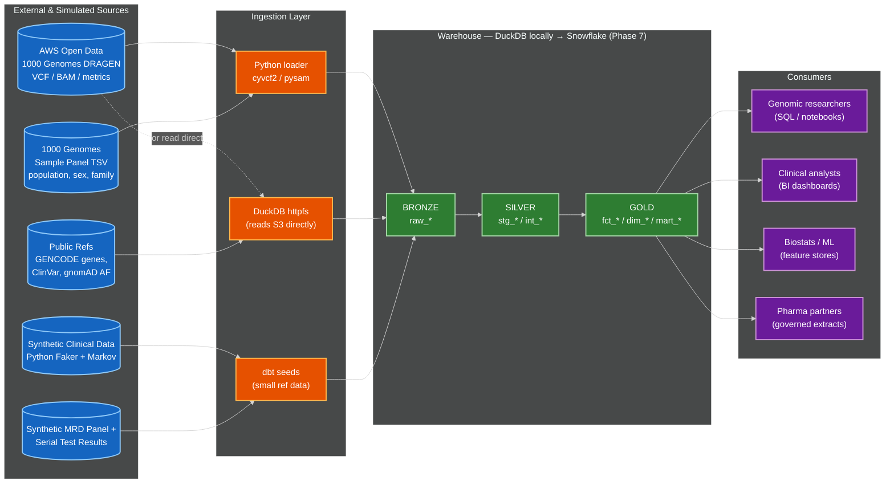
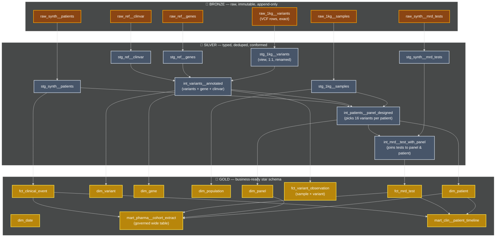
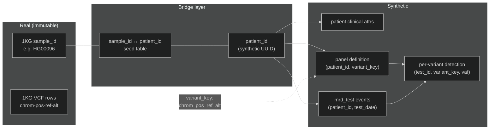
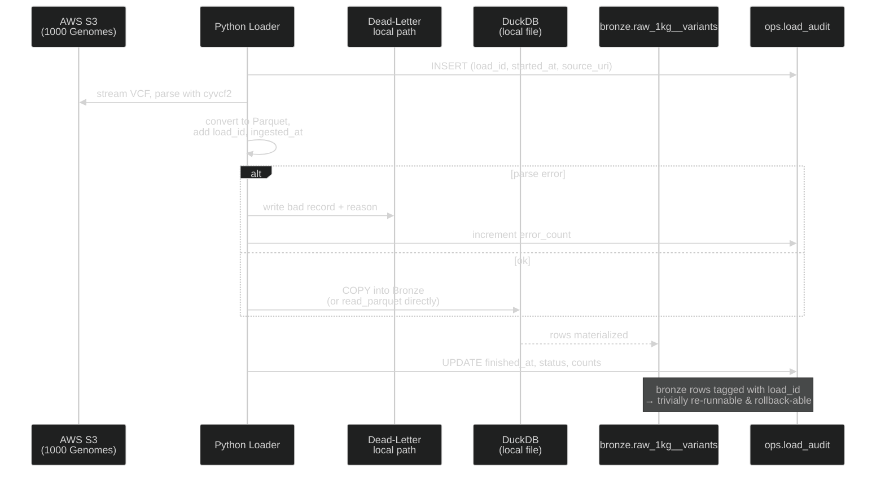

# Phase 8 - Docs
**Goal:** make the project showable. A great warehouse with no narrative is just code; with documentation, a README you'd happily share, and ten reproducible analytical queries, it becomes a portfolio piece.

The 10 persona-aligned analytical queries are pre-built and available in the `analyses/` artifact bundle from the project plan. Each demonstrates a specific user persona accessing the warehouse:

| # | Persona | Query |
|---|---|---|
| 1 | Genomic Researcher | Pathogenic variants in target gene set across an ancestry group |
| 2 | Genomic Researcher | Allele frequency of a variant by super-population |
| 3 | Clinical Analyst | MRD positivity at 90/180/365/730 day landmarks |
| 4 | Clinical Analyst | MRD-to-recurrence lead time by stage |
| 5 | Biostats / ML | Per-patient feature matrix for survival modeling |
| 6 | Pharma Partner | Trial-scoped Day 90 status by treatment arm |
| 7 | Clin Ops | Operational dashboard: stale tests |
| 8 | Genomic Researcher | Patient-scoped panel detection trajectory |
| 9 | Biostats / ML | Cumulative incidence of recurrence by stage with censoring |
| 10 | Clinical Analyst | Serial-testing compliance at 12-month landmark |

## Commands (step-by-step)
```bash
#######################################################
# 8. DOCS
#######################################################

# create docs directory (from repo root)
mkdir -p genomics_dwh/docs
mkdir -p .github/workflows

# create profiles.yml for GitHub Action
cat > genomics_dwh/profiles.yml <<'EOF'
# genomics_dwh/profiles.yml
genomics_dwh:
  target: dev
  outputs:
    dev:
      type: duckdb
      # Looks for an environment variable; defaults to local root path if empty
      path: "{{ env_var('DBT_DUCKDB_PATH', '../warehouse.duckdb') }}"
EOF

# automate GitHub doc generation using GitHub Actions
cat > .github/workflows/deploy_docs.yml <<'EOF'
name: Deploy dbt Docs

on:
  push:
    branches:
      - main
    paths:
      - 'genomics_dwh/models/**'
      - 'genomics_dwh/macros/**'
      - 'genomics_dwh/dbt_project.yml'

permissions:
  contents: write

env:
  FORCE_JAVASCRIPT_ACTIONS_TO_NODE24: true

jobs:
  deploy-docs:
    runs-on: ubuntu-latest
    steps:
      - name: Checkout Repository
        uses: actions/checkout@v4

      - name: Set up Python
        uses: actions/setup-python@v5
        with:
          python-version: '3.12'

      - name: Install dbt and Dependencies
        run: |
          pip install dbt-duckdb dbt-utils
          dbt deps --project-dir ./genomics_dwh

      - name: Generate dbt Docs
        working-directory: ./genomics_dwh
        env:
          DBT_DUCKDB_PATH: "./ci_warehouse.duckdb"
        run: |
          dbt docs generate --profiles-dir .

      - name: Deploy to GitHub Pages
        uses: peaceiris/actions-gh-pages@v4
        with:
          github_token: ${{ secrets.GITHUB_TOKEN }}
          publish_dir: ./genomics_dwh/target
EOF

# update README.md file for repo docs
cat > README.md <<'EOF'
# 1000 Genomes Data Warehouse — Reference Implementation

A medallion-architecture data warehouse that ingests 1000 Genomes Project germline VCFs,
synthesizes MRD test data on top, and exposes a star schema plus governed
OBT marts for downstream analytical use cases. Built with dbt on DuckDB locally, with a
dispatch-macro architecture that ports cleanly to Snowflake (see `runbook/phase-7-snowflake.md`).

## Architecture



## What's in this repo

- `loader/` — Python ingestion scripts (VCF → Parquet, panel TSV, GENCODE/ClinVar)
- `synth/` — Synthetic clinical and MRD trajectory generators (deterministic from `--seed`)
- `genomics_dwh/` — dbt project (9 staging views, 3 intermediate tables, 6 dimensions, 4 facts, 2 OBT marts, 1 snapshot, 91 tests)
- `bronze/` — Lakehouse Bronze layer (Parquet on disk; gitignored)
- `data/raw/` — Raw VCFs, reference data (gitignored)
- `analyses/` — 10 persona-aligned analytical queries demonstrating real warehouse use
- `docs/` — Architecture diagrams, dbt docs site, Snowflake benchmark captures
  - [dbt docs site - auto-generated](https://mikesparr.github.io/1000-genomes-dwh/#!/overview)
  - [mart analyses results](genomics_dwh/docs/analysis_outputs/all_results.md)
- `runbook/` — Per-phase command logs with captured outputs (full reproducibility)
- `orchestrator/` - Dagster data pipeline configuration

## Dagster Orchestration Example
See in `runbook/phase-9-dagster.md` how to set up Dagster to wrap Python and dbt 
in a single asset graph.


## Running it with Dagster

```bash
# 1. Environment (one-time)
python3.12 -m venv .venv && source .venv/bin/activate
pip install -r requirements.txt
brew install duckdb bcftools awscli

# Set the warehouse root location so dbt sources can find Bronze
export DWH_REPO_ROOT=$(pwd)
# Or use direnv: echo "export DWH_REPO_ROOT=$(pwd)" > .envrc && direnv allow

# configure dagster dir (tmp files while running)
cd ../orchestrator
DAGSTER_HOME="$(pwd)/.dagster_home"
mkdir -p "$DAGSTER_HOME"

# run dagster webserver visible at http://localhost:3000
dg dev -f definitions.py
# CTRL+C to stop

# navigate to CATALOG, select all, click "MATERIALIZE", and view Runs
```

## Running it from scratch

```bash
# 1. Environment (one-time)
python3.12 -m venv .venv && source .venv/bin/activate
pip install -r requirements.txt
brew install duckdb bcftools awscli

# Set the warehouse root location so dbt sources can find Bronze
export DWH_REPO_ROOT=$(pwd)
# Or use direnv: echo "export DWH_REPO_ROOT=$(pwd)" > .envrc && direnv allow

# 2. Acquire data (~30-50 min; ~200GB disk for 50 samples)
python loader/fetch_1kg_data.py --samples 50 --seed 42
python loader/extract_region.py --region chr22
./loader/fetch_reference_data.sh

# 3. Bronze layer (~5 min)
duckdb warehouse.duckdb < loader/init_warehouse.sql
python loader/vcf_to_parquet.py
python loader/panel_to_parquet.py
python loader/reference_to_parquet.py

# 4. Synthetic data (~30 sec)
python synth/generate_patients.py --seed 42
python synth/generate_panels.py --seed 42
python synth/generate_trajectories.py --seed 42
python synth/synth_to_parquet.py

# 5. dbt build
cd genomics_dwh
dbt deps
dbt snapshot
dbt build
# Expected: PASS=109+ WARN=0 ERROR=0

# 6. Explore
dbt docs generate && dbt docs serve
# Or run any of the persona analytical queries
dbt show --select q03_mrd_positivity_by_landmark --limit 50
EOF

# add dbt project README
cat > genomics_dwh/README.md <<'EOF'
Welcome to our dbt project!

## Medallion Layer Mapping


**Why this layering matters** (lifted from current dbt guidance): Bronze — raw data, loaded as-is from source systems · Silver — cleaned, deduplicated, and properly typed data · Gold — aggregated, business-ready tables for reporting and analytics. Bronze Layer = Staging Models (stg_) - One-to-one source relationships · Silver Layer = Intermediate Models (int_) - Business logic transformations · Gold Layer = Marts (dim_, fct_) - Business-ready data products.

The Bronze/Silver/Gold language and the dbt staging/intermediate/marts language describe the same pattern; this project uses both consistently — **Bronze = `raw_*` tables, Silver = `stg_*` (views) + `int_*` (tables), Gold = `dim_* / fct_* / mart_*`**.

---

## The Linking Strategy

The Linking Strategy



The **`variant_key = chrom || '_' || pos || '_' || ref || '_' || alt`** is the natural key shared across genomic and clinical worlds. This is the join you'll write a hundred times — make it a macro on day one.

---

## Ingestion Sequence (with Failure Handling)



**Resiliency principles baked in:**

- **Append-only Bronze** with `load_id` and `ingested_at` audit columns. Never `DELETE` — re-runs become a `WHERE load_id NOT IN (failed_loads)` filter in Silver.
- **Idempotent Bronze loads** — if you re-run for the same `source_uri`, you get the same `load_id` (deterministic hash) and old rows are dropped before insert via `MERGE`, or you stamp them inactive.
- **Dead-letter prefix** for malformed VCF rows so analysts can audit data quality.
- **Snapshot the DuckDB file** before risky transformations (`cp warehouse.duckdb warehouse.duckdb.bak`) — poor-man's time travel. When you port to Snowflake, real Time Travel takes over (default 1 day, up to 90 on Enterprise).
- **Incremental Bronze→Silver** via dbt's `is_incremental()` pattern, gated on `load_id`.

---

## dbt Materialization Strategy (DuckDB & Snowflake)

| Layer | Materialization | Why |
|---|---|---|
| `raw_*` | Bronze table, loaded by Python, *not* a dbt model | dbt doesn't own ingestion — it's downstream |
| `stg_*` | **view** | Cheap, always fresh, no storage; it's just a typed alias of bronze |
| `int_*` | **table** (or **ephemeral** for tiny utility transforms) | Materialize once per run so downstream marts join from real tables |
| `dim_*` | **table** (full refresh nightly is fine for dims < 10M rows) | Small, queried often, full rebuild simpler than incremental edge cases |
| `fct_variant_observation` | **incremental** with `unique_key=['sample_id_1kg','variant_key']`, `on_schema_change='append_new_columns'` | This is the billion-row table; full rebuilds are expensive |
| `fct_mrd_test` | **incremental** with `unique_key='test_sk'` | Time-series; only new test dates each run |
| `mart_*` | **table** (or materialized view in Snowflake) for hot ones | Optimized for end-user query speed |

This mapping follows the canonical dbt guidance: staging: +materialized: view, intermediate: +materialized: table, marts: +materialized: table.

**The same materializations work in both DuckDB and Snowflake.** The differences show up only in the *physical optimization* layer — clustering keys, search optimization, automatic clustering services — which we'll wrap in Jinja conditionals (``) so the project runs end-to-end in either target.
EOF

# add temp docs README.md
cat > genomics_dwh/docs/README.md <<'EOF'

EOF

# create runbook dir
mkdir -p runbook
touch runbook/phase-0-environment.md
touch runbook/phase-1-data-fetch.md
touch runbook/phase-2-bronze.md
touch runbook/phase-3-synth.md
touch runbook/phase-4-staging.md
touch runbook/phase-5-intermediate.md
touch runbook/phase-6-marts.md
touch runbook/phase-7-snowflake.md
touch runbook/phase-8-docs.md
touch runbook/phase-9-dagster.md

# add runbook README.md
cat > runbook/README.md <<'EOF'
# 1000 Genomes Data Warehouse — Reproducibility Runbook

This runbook captures every command, configuration, and resolution from building the
warehouse from scratch on a fresh machine. Each per-phase file pairs the commands
with their actual terminal output, so anyone replaying these steps can verify they
got the same result.

## How to use this runbook

- Follow the phases in order. Each builds on the previous one.
- Don't skip the verification commands — they're how you'll know each phase succeeded.
- When a step's output doesn't match what's documented here, stop and diagnose.
  Catching divergence early is much cheaper than catching it three phases later.

## Phases

- [Phase 0 - Python, dbt, pre-commit, sqlfluff setup](phase-0-environment.md)
- [Phase 1 - 1KG samples + chr22 extraction + ref data](phase-1-data-fetch.md)
- [Phase 2 - VCF → Parquet, panel, GENCODE, ClinVar](phase-2-bronze.md)
- [Phase 3 - patients, panels, trajectories](phase-3-synth.md)
- [Phase 4 - 9 staging views + source declarations](phase-4-staging.md)
- [Phase 5 - 3 int tables + custom tests](phase-5-intermediate.md)
- [Phase 6 - dimensions, facts, OBT marts, snapshot](phase-6-marts.md)
- [Phase 7 - port + benchmark capture](phase-7-snowflake.md)
- [Phase 8 - README, docs, analyses](phase-8-docs.md)
- [Phase 9 - Dagster orchestration](phase-9-dagster.md)

## Environment assumptions

- macOS Sonoma+ or recent Linux
- Python 3.12+ in a venv
- Homebrew for system tools (DuckDB, bcftools, AWS CLI)
- ~200GB free disk space if running the full 50-sample fetch
EOF

# Copy the q01_*.sql ... q10_*.sql files plus README.md into dbt analyses directory
cat <<'EOF' > genomics_dwh/analyses/q01_pathogenic_variants_in_genes_by_ancestry.sql
-- analyses/q01_pathogenic_variants_in_genes_by_ancestry.sql
--
-- Persona: Genomic Researcher
-- Question: "Pull all pathogenic variants in <gene set> across <ancestry group> samples"
--
-- Demonstrates: star-schema joins (fact -> 3 dims), ClinVar significance filtering,
-- ancestry-stratified analysis. The kind of query that drives downstream papers and
-- IRB submissions.
--
-- For chr22 specifically, swap in chr22 cancer-relevant genes (NF2, CHEK2, EWSR1, BCR).
-- Generalizes to any gene set + any super-population.
--
-- Run: dbt show --select q01_pathogenic_variants_in_genes_by_ancestry --limit 25

with target_genes as (
    -- chr22 cancer-relevant gene set; expand via COSMIC Cancer Gene Census in production
    select unnest(['NF2', 'CHEK2', 'EWSR1', 'BCR', 'PDGFB', 'EP300', 'SMARCB1']) as gene_symbol
),

target_population as (
    select 'EUR' as super_population
)

select
    v.gene_symbol,
    v.variant_key,
    v.chromosome,
    v.position,
    v.ref_allele,
    v.alt_allele,
    v.rsid,
    v.clinvar_significance,
    v.clinvar_disease_names,
    pop.super_population,
    count(distinct fvo.sample_id_1kg) as n_samples_with_variant,
    avg(fvo.variant_allele_freq) as mean_vaf,
    avg(fvo.read_depth) as mean_read_depth
from {{ ref('fct_variant_observation') }} as fvo
inner join {{ ref('dim_variant') }} as v on fvo.variant_sk = v.variant_sk
inner join {{ ref('dim_patient') }} as p on fvo.patient_sk = p.patient_sk
inner join {{ ref('dim_population') }} as pop
    on
        p.ancestry_super_population = pop.super_population
        and p.ancestry_population_code = pop.population_code
where
    v.gene_symbol in (select gene_symbol from target_genes)
    and pop.super_population in (select super_population from target_population)
    and (
        v.clinvar_significance ilike '%pathogenic%'
        or v.clinvar_significance ilike '%likely_pathogenic%'
    )
    and p.is_current
group by
    v.gene_symbol,
    v.variant_key,
    v.chromosome,
    v.position,
    v.ref_allele,
    v.alt_allele,
    v.rsid,
    v.clinvar_significance,
    v.clinvar_disease_names,
    pop.super_population
order by n_samples_with_variant desc, v.gene_symbol, v.position
EOF

cat <<'EOF' > genomics_dwh/analyses/q02_allele_frequency_by_population.sql
-- analyses/q02_allele_frequency_by_population.sql
--
-- Persona: Genomic Researcher
-- Question: "What's the allele frequency of variant X by super-population?"
--
-- Demonstrates: aggregation across populations, allele frequency calculation
-- from genotype data (not just AC/AN counts), and the kind of cross-population
-- comparison that's the bread-and-butter of population genetics.
--
-- Set the variant_key filter for the variant of interest. Run for any chr22 SNV
-- you can find in dim_variant.
--
-- Run: dbt show --select q02_allele_frequency_by_population --limit 10

with variant_of_interest as (
    -- Pick any variant_key that exists in dim_variant; substitute as needed
    select variant_key
    from {{ ref('dim_variant') }}
    where variant_type = 'SNV'
      and rsid is not null
    order by variant_key
    limit 1
),

genotyped as (
    select
        fvo.variant_key,
        pop.super_population,
        fvo.sample_id_1kg,
        fvo.genotype,
        -- Count alt alleles per genotype: 0/0=0, 0/1=1, 1/1=2, ./.=null
        case
            when fvo.genotype in ('0/0', '0|0') then 0
            when fvo.genotype in ('0/1', '0|1', '1/0', '1|0') then 1
            when fvo.genotype in ('1/1', '1|1') then 2
            else null
        end as alt_allele_count,
        case
            when fvo.genotype in ('./.', '.|.') then 0
            else 2
        end as called_allele_count
    from {{ ref('fct_variant_observation') }} as fvo
    inner join variant_of_interest as voi on fvo.variant_key = voi.variant_key
    inner join {{ ref('dim_patient') }} as p
        on fvo.patient_sk = p.patient_sk
    inner join {{ ref('dim_population') }} as pop
        on
            p.ancestry_super_population = pop.super_population
            and p.ancestry_population_code = pop.population_code
    where p.is_current
)

select
    variant_key,
    super_population,
    count(distinct sample_id_1kg) as n_samples,
    sum(alt_allele_count) as alt_allele_total,
    sum(called_allele_count) as called_allele_total,
    cast(sum(alt_allele_count) as double) / nullif(sum(called_allele_count), 0)
        as allele_frequency,
    sum(case when alt_allele_count = 2 then 1 else 0 end) as homozygous_alt_count,
    sum(case when alt_allele_count = 1 then 1 else 0 end) as heterozygous_count
from genotyped
where alt_allele_count is not null
group by variant_key, super_population
order by allele_frequency desc
EOF

cat <<'EOF' > genomics_dwh/analyses/q03_mrd_positivity_by_landmark.sql
-- analyses/q03_mrd_positivity_by_landmark.sql
--
-- Persona: Clinical Analyst
-- Question: "MRD positivity rate at 90 / 180 / 365 / 730 days post-surgery,
--            by tumor type and stage at diagnosis"
--
-- Demonstrates: the OBT mart paying off — zero joins, reads only from
-- mart_clin__patient_timeline because all landmark statuses were pre-pivoted
-- in Phase 6.8. This is exactly the query a Tableau/Looker dashboard would issue.
--
-- Run: dbt show --select q03_mrd_positivity_by_landmark --limit 50

select
    tumor_type,
    stage_at_diagnosis,
    count(*) as n_patients,
    -- Day 90 landmark
    sum(case when mrd_status_d90 = true then 1 else 0 end) as positive_d90,
    sum(case when mrd_status_d90 is not null then 1 else 0 end) as evaluable_d90,
    round(
        100.0 * sum(case when mrd_status_d90 = true then 1 else 0 end)
        / nullif(sum(case when mrd_status_d90 is not null then 1 else 0 end), 0),
        1
    ) as pct_positive_d90,
    -- Day 180 landmark
    sum(case when mrd_status_d180 = true then 1 else 0 end) as positive_d180,
    sum(case when mrd_status_d180 is not null then 1 else 0 end) as evaluable_d180,
    round(
        100.0 * sum(case when mrd_status_d180 = true then 1 else 0 end)
        / nullif(sum(case when mrd_status_d180 is not null then 1 else 0 end), 0),
        1
    ) as pct_positive_d180,
    -- Day 365 landmark
    sum(case when mrd_status_d365 = true then 1 else 0 end) as positive_d365,
    sum(case when mrd_status_d365 is not null then 1 else 0 end) as evaluable_d365,
    round(
        100.0 * sum(case when mrd_status_d365 = true then 1 else 0 end)
        / nullif(sum(case when mrd_status_d365 is not null then 1 else 0 end), 0),
        1
    ) as pct_positive_d365,
    -- Day 730 landmark (2-year)
    sum(case when mrd_status_d730 = true then 1 else 0 end) as positive_d730,
    sum(case when mrd_status_d730 is not null then 1 else 0 end) as evaluable_d730,
    round(
        100.0 * sum(case when mrd_status_d730 = true then 1 else 0 end)
        / nullif(sum(case when mrd_status_d730 is not null then 1 else 0 end), 0),
        1
    ) as pct_positive_d730
from {{ ref('mart_clin__patient_timeline') }}
group by tumor_type, stage_at_diagnosis
order by tumor_type, stage_at_diagnosis
EOF

cat <<'EOF' > genomics_dwh/analyses/q04_mrd_lead_time_analysis.sql
-- analyses/q04_mrd_lead_time_analysis.sql
--
-- Persona: Clinical Analyst
-- Question: "Show me patients who turned MRD+ before clinical recurrence —
--            what was the lead time?"
--
-- Demonstrates: the headline value proposition of MRD testing — *predicting*
-- recurrence months before imaging or symptoms can. Lead time is the days between
-- first MRD-positive test and the eventual clinical recurrence event, computed
-- per-patient and stratified by stage.
--
-- This is what oncologists cite when explaining why MRD assays change clinical
-- practice. It's also one of the trial endpoints regulators care most about.
--
-- Run: dbt show --select q04_mrd_lead_time_analysis --limit 50

with patients_with_lead_time as (
    select
        patient_sk,
        tumor_type,
        stage_at_diagnosis,
        treatment_arm,
        first_positive_date,
        first_recurrence_date,
        mrd_lead_time_days
    from {{ ref('mart_clin__patient_timeline') }}
    where has_recurred
      and mrd_lead_time_days is not null
      and mrd_lead_time_days > 0   -- exclude patients where MRD+ came after recurrence
)

select
    stage_at_diagnosis,
    count(*) as n_patients,
    round(avg(mrd_lead_time_days), 1) as avg_lead_days,
    median(mrd_lead_time_days) as median_lead_days,
    min(mrd_lead_time_days) as min_lead_days,
    max(mrd_lead_time_days) as max_lead_days,
    -- Convert to months for clinical interpretability
    round(avg(mrd_lead_time_days) / 30.0, 1) as avg_lead_months,
    round(median(mrd_lead_time_days) / 30.0, 1) as median_lead_months,
    -- Quartiles for distribution shape
    quantile_cont(mrd_lead_time_days, 0.25) as q1_lead_days,
    quantile_cont(mrd_lead_time_days, 0.75) as q3_lead_days
from patients_with_lead_time
group by stage_at_diagnosis
order by stage_at_diagnosis
EOF

cat <<'EOF' > genomics_dwh/analyses/q05_biostats_feature_matrix.sql
-- analyses/q05_biostats_feature_matrix.sql
--
-- Persona: Biostats / ML
-- Question: "Build a feature matrix: per patient, baseline panel size,
--            baseline ctDNA status, treatment arm, time-to-recurrence"
--
-- Demonstrates: the "wide" feature shape ML pipelines want — one row per patient,
-- every feature as a column. The pharma cohort extract already does most of this
-- work because it's designed for downstream model training; here we shape the
-- output specifically for survival modeling (lifelines / R survival package input).
--
-- Output schema is intentionally close to scikit-learn / lifelines input format:
-- numeric and categorical features + (event_observed, time_to_event) for survival.
--
-- Note on panel_size: this project's panel generator produces exactly 16 variants
-- per patient by design, so it's a constant in this dataset. In a production
-- system with variable panel sizes, the right fix is to add panel_size as a
-- column to mart_clin__patient_timeline (so it propagates through to the
-- pharma extract), not to join dim_panel here — the pharma extract masks
-- patient_sk via md5(), making downstream joins back to dim_panel impossible
-- by design.
--
-- Run: dbt show --select q05_biostats_feature_matrix --limit 25

with cohort as (
    select * from {{ ref('mart_pharma__cohort_extract') }}
)

select
    c.patient_sk_masked,
    -- Demographic features
    c.age_at_diagnosis,
    c.sex_at_birth,
    c.ancestry_super_population,
    -- Disease features
    c.tumor_type,
    c.stage_at_diagnosis,
    -- Treatment features
    c.trial_id,
    c.treatment_arm,
    -- Panel / assay design feature (constant 16 in this project's design)
    16 as baseline_panel_size,
    -- MRD trajectory features (early signals usable as ML features)
    cast(c.mrd_status_d90 as integer) as mrd_status_d90_int,
    cast(c.mrd_status_d180 as integer) as mrd_status_d180_int,
    cast(c.mrd_status_d365 as integer) as mrd_status_d365_int,
    -- Survival analysis target columns (lifelines / survival package input)
    -- event_observed = 1 if recurrence occurred, 0 if censored
    cast(c.has_recurred as integer) as event_observed,
    -- time_to_event = days_to_recurrence if it occurred,
    -- else days from last_test_date to surgery (the follow-up window)
    -- Note: in a real system you'd use the patient's primary_surgery_date as
    -- the anchor and last_test_date as the censor point; the pharma extract
    -- intentionally doesn't expose primary_surgery_date (privacy), so the
    -- censor calculation has to be done upstream in the timeline mart.
    c.days_to_recurrence as time_to_event_days,
    -- Outcome at common landmarks (for binary classification targets)
    c.recurrence_within_2yr,
    c.event_status
from cohort as c
order by c.patient_sk_masked
EOF

cat <<'EOF' > genomics_dwh/analyses/q06_pharma_trial_landmark_by_arm.sql
-- analyses/q06_pharma_trial_landmark_by_arm.sql
--
-- Persona: Pharma Partner
-- Question: "For trial NCT11111111 (ADJUVO-1), give me MRD landmark status at
--            day 90 stratified by treatment arm"
--
-- Demonstrates: trial-scoped, governance-aware analytical extraction.
--   - Reads ONLY from mart_pharma__cohort_extract (already filtered to consented
--     patients in Phase 6.9 — non-consented patients are technically unreachable)
--   - Patient identifiers are pre-masked (patient_sk_masked) — pharma sees no PHI
--   - Stratification by treatment_arm is the standard primary endpoint shape
--
-- This is the canonical "data delivery to a clinical trial sponsor" query. In
-- production, this would be the body of a stored proc / scheduled extract that
-- pharma reads via a Snowflake share or governed view.
--
-- Run: dbt show --select q06_pharma_trial_landmark_by_arm --limit 50

with trial_cohort as (
    select * from {{ ref('mart_pharma__cohort_extract') }}
    where trial_id = 'NCT11111111'  -- ADJUVO-1; substitute as needed
)

select
    trial_id,
    treatment_arm,
    tumor_type,
    stage_at_diagnosis,
    count(*) as n_enrolled,
    -- Day 90 MRD outcomes
    sum(case when mrd_status_d90 = true then 1 else 0 end) as positive_d90,
    sum(case when mrd_status_d90 = false then 1 else 0 end) as negative_d90,
    sum(case when mrd_status_d90 is null then 1 else 0 end) as not_evaluable_d90,
    round(
        100.0 * sum(case when mrd_status_d90 = true then 1 else 0 end)
        / nullif(sum(case when mrd_status_d90 is not null then 1 else 0 end), 0),
        1
    ) as pct_positive_d90,
    -- Recurrence outcome through 2 years
    sum(case when recurrence_within_2yr = true then 1 else 0 end) as recurred_within_2yr,
    round(
        100.0 * sum(case when recurrence_within_2yr = true then 1 else 0 end)
        / nullif(count(*), 0),
        1
    ) as pct_recurred_within_2yr,
    -- Median time-to-recurrence among recurrers
    median(case when recurrence_within_2yr then days_to_recurrence end)
        as median_days_to_recurrence
from trial_cohort
group by trial_id, treatment_arm, tumor_type, stage_at_diagnosis
order by trial_id, treatment_arm, tumor_type, stage_at_diagnosis
EOF

cat <<'EOF' > genomics_dwh/analyses/q07_clin_ops_pending_tests.sql
-- analyses/q07_clin_ops_pending_tests.sql
--
-- Persona: Clinical Operations
-- Question: "How many tests are pending result delivery > 7 days?"
--
-- Demonstrates: an operational-dashboard query — the kind of thing that runs
-- every 15 minutes and powers a "production health" dashboard for the lab ops
-- team. Filters narrow to recent tests, so clustering on test_date is doing
-- 99% of the I/O reduction work.
--
-- In our synthetic data we don't model "pending" status explicitly — every test
-- has a result. So we approximate by looking at the *latest* test per patient
-- and counting those where the most recent test was >7 days ago without a
-- subsequent test being scheduled. In a real production warehouse you'd have
-- a `test_status` column with values like 'collected', 'in_lab', 'reported'.
--
-- Run: dbt show --select q07_clin_ops_pending_tests --limit 50

with latest_test_per_patient as (
    select
        patient_sk,
        max(test_date) as last_test_date,
        max(test_sequence_number) as last_test_sequence
    from {{ ref('fct_mrd_test') }}
    -- Production: filter to last 30 days for partition pruning
    where test_date >= current_date - interval '180 days'
    group by patient_sk
),

stale_tests as (
    select
        patient_sk,
        last_test_date,
        last_test_sequence,
        date_diff('day', last_test_date, current_date) as days_since_last_test
    from latest_test_per_patient
    where date_diff('day', last_test_date, current_date) > 7
)

select
    -- Buckets clinical ops cares about
    case
        when days_since_last_test between 8 and 14 then '08-14 days'
        when days_since_last_test between 15 and 30 then '15-30 days'
        when days_since_last_test between 31 and 60 then '31-60 days'
        else '> 60 days'
    end as bucket,
    count(*) as n_patients,
    min(last_test_date) as oldest_test_date,
    max(last_test_date) as newest_test_date,
    round(avg(days_since_last_test), 0) as avg_days_pending
from stale_tests
group by bucket
order by min(days_since_last_test)
EOF

cat <<'EOF' > genomics_dwh/analyses/q08_patient_panel_detection_trajectory.sql
-- analyses/q08_patient_panel_detection_trajectory.sql
--
-- Persona: Genomic Researcher
-- Question: "Variants in panel for patient PT-HG00096 detected in their last
--            3 blood draws"
--
-- Demonstrates: patient-scoped pruning at the fact level. The first CTE filters
-- to a single patient_sk (1 of 28 in this slice, or 1 of 30k at production scale).
-- Downstream joins to fct_mrd_detection and dim_variant operate on the tiny
-- already-filtered result set, so the query runs in milliseconds against any
-- properly-clustered warehouse.
--
-- The output shape is the "detection heatmap" researchers love: rows = panel
-- variants × tests, columns = detection / VAF. Useful for understanding which
-- variants in the panel are most informative for THIS patient's recurrence dynamics.
--
-- Run: dbt show --select q08_patient_panel_detection_trajectory --limit 50

with target_patient as (
    -- Substitute any patient_id of interest
    select patient_sk, patient_id
    from {{ ref('dim_patient') }}
    where patient_id = 'PT-HG00096'
      and is_current
),

last_three_tests as (
    select
        t.test_sk,
        t.test_id,
        t.test_date,
        t.test_sequence_number,
        t.is_positive,
        t.mtm_per_ml,
        row_number() over (
            partition by t.patient_sk
            order by t.test_date desc
        ) as rn_recent
    from {{ ref('fct_mrd_test') }} as t
    inner join target_patient as tp on t.patient_sk = tp.patient_sk
    qualify rn_recent <= 3
)

select
    v.gene_symbol,
    v.variant_key,
    v.chromosome,
    v.position,
    v.ref_allele,
    v.alt_allele,
    v.clinvar_significance,
    l.test_sequence_number,
    l.test_date,
    l.is_positive as test_is_positive,
    d.vaf_blood,
    d.is_detected
from last_three_tests as l
inner join {{ ref('fct_mrd_detection') }} as d on l.test_sk = d.test_sk
inner join {{ ref('dim_variant') }} as v on d.variant_sk = v.variant_sk
order by l.test_sequence_number, v.gene_symbol nulls last, v.position
EOF

cat <<'EOF' > genomics_dwh/analyses/q09_cumulative_incidence_by_stage.sql
-- analyses/q09_cumulative_incidence_by_stage.sql
--
-- Persona: Biostats / ML
-- Question: "Cumulative incidence of recurrence by stage, censored at last visit"
--
-- Demonstrates: time-to-event analysis fundamentals — censoring, cumulative
-- incidence, stage stratification. This is the data shape the biostats team
-- feeds into Kaplan-Meier curves (`survfit` in R, `lifelines` in Python).
--
-- Outputs one row per (stage, time_window) showing how many patients had recurred
-- by that point and how many were still being followed (at-risk). The biostats
-- team takes this and computes survival curves; we don't compute KM math in SQL
-- (it's a numerical algorithm with non-trivial edge cases) — we hand them the
-- right *shape*.
--
-- Run: dbt show --select q09_cumulative_incidence_by_stage --limit 100

with patient_outcomes as (
    select
        patient_sk,
        stage_at_diagnosis,
        primary_surgery_date,
        first_recurrence_date,
        last_test_date,
        has_recurred,
        days_to_recurrence,
        case
            when has_recurred then days_to_recurrence
            else date_diff('day', primary_surgery_date, last_test_date)
        end as time_to_event_or_censor_days,
        cast(has_recurred as integer) as event_observed
    from {{ ref('mart_clin__patient_timeline') }}
    where primary_surgery_date is not null
),

-- Generate landmark windows at clinically-relevant intervals
landmarks as (
    select unnest([90, 180, 365, 540, 730, 1095]) as landmark_days
),

-- For each (stage, landmark), count events that occurred by that point
-- and patients still at risk (followed past the landmark)
stage_landmark_grid as (
    select
        po.stage_at_diagnosis,
        l.landmark_days,
        count(*) filter (
            where po.event_observed = 1
            and po.time_to_event_or_censor_days <= l.landmark_days
        ) as cumulative_events,
        count(*) filter (
            where po.time_to_event_or_censor_days >= l.landmark_days
        ) as at_risk_at_landmark,
        count(*) as total_in_stage
    from patient_outcomes as po
    cross join landmarks as l
    group by po.stage_at_diagnosis, l.landmark_days
)

select
    stage_at_diagnosis,
    landmark_days,
    round(landmark_days / 30.0, 1) as landmark_months,
    cumulative_events,
    at_risk_at_landmark,
    total_in_stage,
    -- Crude cumulative incidence (events / total at start)
    round(100.0 * cumulative_events / nullif(total_in_stage, 0), 1)
        as crude_cumulative_incidence_pct,
    -- Percent still at risk (informs how trustworthy the estimate is)
    round(100.0 * at_risk_at_landmark / nullif(total_in_stage, 0), 1)
        as pct_at_risk_at_landmark
from stage_landmark_grid
order by stage_at_diagnosis, landmark_days
EOF

cat <<'EOF' > genomics_dwh/analyses/q10_serial_testing_compliance.sql
-- analyses/q10_serial_testing_compliance.sql
--
-- Persona: Clinical Analyst
-- Question: "What % of patients have at least 4 serial tests by the 12-month
--            landmark?"
--
-- Demonstrates: a self-service dashboard query that's pure aggregation against
-- the patient timeline mart. Operational metric — serial-testing compliance is
-- one of the things commercial teams track to gauge product adoption and
-- protocol adherence. Stratified by tumor type so different disease-area teams
-- can see their own numbers.
--
-- Run: dbt show --select q10_serial_testing_compliance --limit 50

with patients_at_12mo as (
    select
        patient_sk,
        tumor_type,
        stage_at_diagnosis,
        treatment_arm,
        total_test_count,
        date_diff('day', primary_surgery_date, last_test_date) as days_followed,
        -- Count tests within the first 365 days post-surgery; patients still
        -- being followed past 365d count as having reached the 12mo landmark
        case
            when date_diff('day', primary_surgery_date, last_test_date) >= 335
                then true
            else false
        end as reached_12mo_followup
    from {{ ref('mart_clin__patient_timeline') }}
    where primary_surgery_date is not null
),

eligible as (
    -- Only count compliance among patients who had a chance to hit 12mo
    select * from patients_at_12mo where reached_12mo_followup
)

select
    tumor_type,
    stage_at_diagnosis,
    count(*) as n_eligible_patients,
    sum(case when total_test_count >= 4 then 1 else 0 end) as n_compliant,
    sum(case when total_test_count >= 4 then 1 else 0 end) * 100.0
    / nullif(count(*), 0)
        as pct_compliant,
    round(avg(total_test_count), 1) as avg_tests_per_patient,
    median(total_test_count) as median_tests_per_patient,
    min(total_test_count) as min_tests,
    max(total_test_count) as max_tests
from eligible
group by tumor_type, stage_at_diagnosis
order by tumor_type, stage_at_diagnosis
EOF

# verify analytics (from dbt project dir)
cd genomics_dwh

# Single query preview
dbt show --select q03_mrd_positivity_by_landmark --limit 50
# Previewing node 'q03_mrd_positivity_by_landmark':
# | tumor_type    | stage_at_diagnosis | n_patients | positive_d90 | evaluable_d90 | pct_positive_d90 | ... |
# | ------------- | ------------------ | ---------- | ------------ | ------------- | ---------------- | --- |
# | bladder       | II                 |          1 |            0 |             1 |              0.0 | ... |
# | breast        | I                  |          1 |            0 |             1 |              0.0 | ... |
# | breast        | II                 |          2 |            0 |             2 |              0.0 | ... |
# | breast        | III                |          3 |            0 |             3 |              0.0 | ... |
# | breast        | IV                 |          3 |            1 |             3 |             33.3 | ... |
# | colorectal    | I                  |          5 |            0 |             5 |              0.0 | ... |
# | colorectal    | II                 |          4 |            0 |             4 |              0.0 | ... |
# | colorectal    | III                |          4 |            0 |             4 |              0.0 | ... |
# | colorectal    | IV                 |          2 |            0 |             2 |              0.0 | ... |
# | head_and_neck | III                |          1 |            0 |             1 |              0.0 | ... |
# | head_and_neck | IV                 |          1 |            1 |             1 |            100.0 | ... |
# | lung_nsclc    | I                  |          1 |            0 |             1 |              0.0 | ... |
# | lung_nsclc    | II                 |          1 |            0 |             1 |              0.0 | ... |
# | lung_nsclc    | III                |          2 |            0 |             2 |              0.0 | ... |
# | lung_nsclc    | IV                 |          1 |            0 |             1 |              0.0 | ... |
# | melanoma      | I                  |          3 |            0 |             3 |              0.0 | ... |
# | melanoma      | II                 |          1 |            0 |             1 |              0.0 | ... |
# | melanoma      | IV                 |          1 |            0 |             1 |              0.0 | ... |
# | ovarian       | III                |          1 |            0 |             1 |              0.0 | ... |
# | pancreatic    | III                |          1 |            0 |             1 |              0.0 | ... |
# | pancreatic    | IV                 |          2 |            1 |             2 |             50.0 | ... |
# | prostate      | I                  |          5 |            0 |             5 |              0.0 | ... |
# | prostate      | III                |          1 |            0 |             1 |              0.0 | ... |
# | renal         | I                  |          2 |            0 |             2 |              0.0 | ... |
# | renal         | IV                 |          1 |            1 |             1 |            100.0 | ... |


# Capture compiled SQL to disk (useful for sharing with non-dbt users)
dbt compile --select path:analyses
# 21:31:24  Found 24 models, 1 snapshot, 10 analyses, 91 data tests, 9 sources, 604 macros

ls target/compiled/genomics_dwh/analyses/

# Run all 10 against DuckDB and capture results to a single markdown file
mkdir -p docs/analysis_outputs
echo "" > docs/analysis_outputs/all_results.md
for q in target/compiled/genomics_dwh/analyses/q*.sql; do
    name=$(basename "$q" .sql)
    echo "## $name" >> docs/analysis_outputs/all_results.md
    echo '```' >> docs/analysis_outputs/all_results.md
    duckdb ../warehouse.duckdb < "$q" >> docs/analysis_outputs/all_results.md
    echo '```' >> docs/analysis_outputs/all_results.md
    echo "" >> docs/analysis_outputs/all_results.md
done

# run linter on sql
sqlfluff lint analyses/
# if error: sqlfluff fix analyses/

# commit (from repo root)
cd .. 
git add README.md runbook/
git add genomics_dwh/profiles.yml genomics_dwh/docs/ genomics_dwh/analyses/ .github/workflows/
git commit -m "Updated docs and analyses files with runbooks"
```